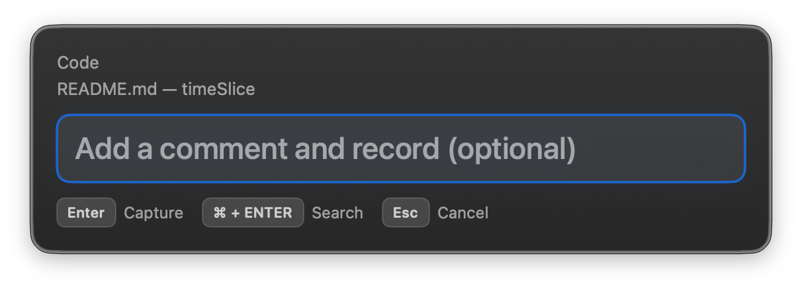
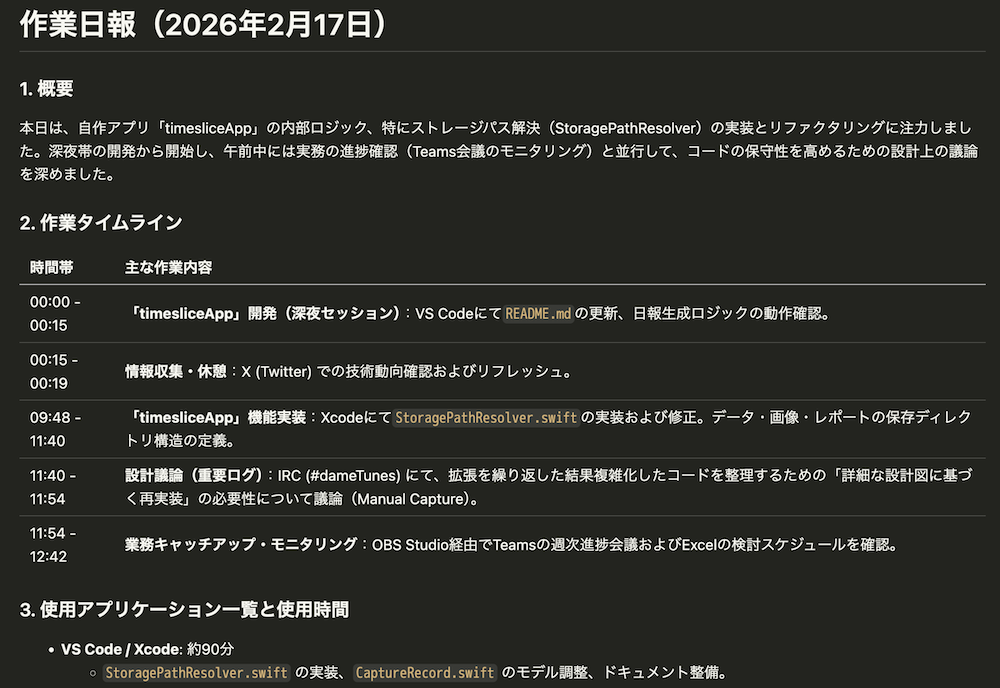
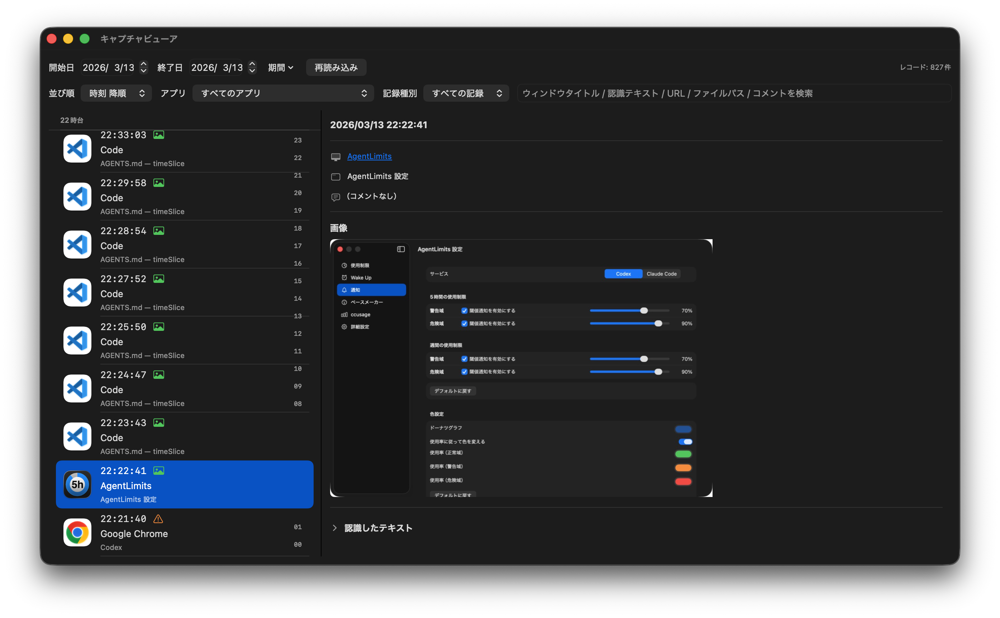

# timeSlice

**開発中**

timeSlice は macOS Sonoma 以降で動作するメニューバーアプリです。作業中に最前面のウィンドウを定期的にキャプチャし、Vision Framework でテキスト認識して保存します。蓄積されたデータを AI エージェント CLI に渡すことで、その日の作業内容をまとめた日報を自動生成できます。

できること:
- フロントウィンドウの定期キャプチャ（デフォルト: 60 秒ごと）
- フロントウィンドウの手動キャプチャ（コメント入力ポップアップ付き）
- 選択範囲を指定してキャプチャ（コメント入力ポップアップ付き）
- ウィンドウタイトル・ドキュメントパス・ブラウザのアクティブタブ URL 取得
- キャプチャ画像からのテキスト認識（Vision Framework）
- AI CLI を使った日報生成（定時自動生成・手動生成）
- 保存データのビューアウィンドウ

テキスト認識処理はすべてデバイス上で完結し、外部サーバーへのデータ送信は行いません。AI 利用部分については、ローカル LLM を利用しない限りは外部の AI サービスにプロンプトと認識テキストが送信される点にご注意ください。

---

## 目次

1. [ダウンロード](#ダウンロード)
2. [はじめての起動](#はじめての起動)
3. [メニューバーの操作](#メニューバーの操作)
4. [キャプチャの仕組み](#キャプチャの仕組み)
5. [日報の生成](#日報の生成)
6. [設定ガイド](#設定ガイド)
   - [一般タブ](#一般タブ)
   - [キャプチャタブ](#キャプチャタブ)
   - [CLI タブ](#cli-タブ)
   - [日報タブ](#日報タブ)
   - [プロンプトタブ](#プロンプトタブ)
7. [ビューアウィンドウ](#ビューアウィンドウ)
8. [データの保存先](#データの保存先)
9. [権限の設定](#権限の設定)
10. [トラブルシューティング](#トラブルシューティング)
11. [ソースからビルド](#ソースからビルド)

---

## ダウンロード

最新版はこちらからダウンロードしてください: [ダウンロード](https://github.com/Nihondo/timeSlice/releases/latest/download/timeSlice.zip)

---

## はじめての起動

1. ダウンロードした zip を展開し、`timeSlice.app` をアプリケーションフォルダに移動します。
2. アプリを起動すると、初回は **画面収録権限** の許可ダイアログが表示されます。「OK」を押して許可してください（権限がないとキャプチャできません）。
3. メニューバーにアイコンが表示されたら起動成功です。アイコンをクリックして「**記録開始**」を選べば、作業の記録が始まります。
4. 日報を生成したい場合は、CLI タブで AI エージェント CLI の設定を行ってから「**日報を生成**」を実行してください。

---

## メニューバーの操作

メニューバーのアイコンは記録状態に応じて外観が変わります。記録していないときは白丸のアイコン、記録中は赤丸のアイコンになります。

アイコンをクリックすると以下のメニューが表示されます。

| メニュー項目 | 説明 |
|---|---|
| **timeSlice 設定...** (⌘,) | 設定ウィンドウを開きます |
| **記録開始 / 記録終了** | キャプチャの開始・停止を切り替えます |
| **今すぐ記録** | コメント入力ポップアップを開き、Enterで記録・⌘ + ENTERでビューア検索を実行します |
| **選択範囲をキャプチャ** | 画面上で矩形を選択してキャプチャし、コメント入力ポップアップを表示します |
| **日報を生成** | 設定した AI CLI を使って日報を生成します |
| **ビューアを開く** | キャプチャビューアを別ウィンドウで開きます |
| **timeSlice について...** | アプリのバージョン情報を表示します |
| **終了** (⌘Q) | アプリを終了します |

### 「今すぐ記録」について



「今すぐ記録」を実行すると、Spotlight に似たコメント入力ポップアップが表示されます。コメントを入力して Enter を押すと、すぐにウィンドウキャプチャ・テキスト認識・保存が実行されます。コメントは省略可能です。

⌘ + ENTER を押すとコメントは保存せず、入力内容をキーワードとしてキャプチャビューア検索を実行します。Esc を押すとキャンセルになり、保存は行われません。

ポップアップ上部には、記録対象のアプリ名とウィンドウタイトルがラベルなしで2行表示されます（タイトルが取得できない場合は「（タイトルなし）」を表示）。

ポップアップが開いたとき、前面アプリで選択中のテキストがあれば自動的にコメント欄に入力されます（アクセシビリティ権限が必要です）。

グローバルショートカットキーを設定しておくと、どのアプリを操作中でも「今すぐ記録」を呼び出せます。ショートカットの設定は[一般タブ](#一般タブ)をご覧ください。

### 「選択範囲をキャプチャ」について

「選択範囲をキャプチャ」を実行すると、macOS の `screencapture` コマンドを使って画面上で任意の矩形領域を選択できます。

選択後にキャプチャ画像のテキスト認識が行われ、「今すぐ記録」と同様のコメント入力ポップアップが表示されます。コメントを入力して Enter を押すと記録が保存されます。Esc を押すとキャプチャ自体がキャンセルされ、保存は行われません。

定期キャプチャとは独立して動作するため、記録中・停止中を問わずいつでも実行できます。記録データの `captureTrigger` は `rectangleCapture` となります。

グローバルショートカットキーを設定しておくと、どのアプリを操作中でも「選択範囲をキャプチャ」を呼び出せます。ショートカットの設定は[一般タブ](#一般タブ)をご覧ください。

---

## キャプチャの仕組み

記録中、timeSlice は設定した間隔（デフォルト 60 秒）ごとに最前面のウィンドウを自動キャプチャします。キャプチャごとに以下の処理が行われます。

まず、フロントアプリ名またはウィンドウタイトルが除外設定に部分一致するか確認します。一致した場合は、認識したテキストと画像保存をスキップし、アプリ名・ウィンドウタイトル等のメタデータのみを記録します。プライベートなウィンドウや機密情報を扱うアプリを除外するのに使います。

除外対象でない場合は、Vision Framework を使ってウィンドウ内のテキストを抽出します。直前の記録と内容が同じ（ハッシュが一致）場合は重複としてスキップし、内容が変化したときだけ新しいレコードとして保存します。

保存されるデータは JSON レコード（常時）と画像ファイル（設定で有効にした場合）です。画像形式は `PNG` / `JPG` から選択できます。JSON には記録日時・アプリ名・ウィンドウタイトル・認識テキスト・記録トリガー（定期 or 手動）・コメント・ブラウザURL・ドキュメントファイルパス（取得可能な場合）が含まれます。

### ブラウザURL取得

フロントアプリがブラウザの場合、アクティブタブの URL を AppleScript 経由で自動取得し、記録に含めます。対応ブラウザは以下の通りです。

| ブラウザ | 対応状況 |
|---|---|
| Safari（Technology Preview を含む） | ✅ |
| Google Chrome（Beta / Dev / Canary を含む） | ✅ |
| Microsoft Edge（Beta / Dev / Canary を含む） | ✅ |
| Brave Browser（Beta / Nightly を含む） | ✅ |
| Arc | ✅ |
| Vivaldi | ✅ |
| Firefox | ❌（AppleScript 非対応） |

初めてブラウザの URL を取得するとき、macOS がオートメーション権限の確認ダイアログを表示します。「OK」を押して許可してください。許可はブラウザごとに個別に必要です。拒否した場合でも URL が `null` になるだけでキャプチャ自体は正常に続行されます。


---

## 日報の生成

timeSlice は外部の AI エージェント CLI（`opencode`、`codex`、`claude`、`gemini` など）を呼び出して日報を生成します。AIにローカル LLM と連携できる `opencode` のような CLI の利用を検討してください。

### 出力サンプル



上記は以下のプロンプトで生成した日報の例です。プロンプトは自由にカスタマイズできます。

```
以下は{{DATE}} ({{TIME_RANGE}}) の作業記録データです。
いまの作業ディレクトリは `timeSlice/data` です。
次のファイルを読み込んで、内容を要約して日報を作成してください:
{{JSON_FILE_LIST}}

期待レコード件数の目安: {{RECORD_COUNT}} 件

各 JSON の構造:
- `applicationName`: フロントアプリ名
- `windowTitle`: ウィンドウタイトル（null の場合あり）
- `capturedAt`: ISO 8601 の記録時刻
- `recognizedText`: 認識テキスト
- `hasImage`: 画像保存フラグ
- `captureTrigger`: 記録トリガー（`manual` = 今すぐ記録、`scheduled` = 定期キャプチャ、`rectangleCapture` = 選択範囲キャプチャ）
- `comments`: 手動記録コメント（空文字の場合あり）
- `browserURL`: ブラウザのアクティブタブURL（null の場合あり、ブラウザアプリのみ）
- `documentPath`: ドキュメントのファイルパス（null の場合あり、対応アプリのみ）

重要:
- 対象時間帯は {{TIME_RANGE}} です。`capturedAt` の時刻がこの範囲に含まれるレコードのみを対象にしてください。
- `captureTrigger` が `manual` または `rectangleCapture` の記録は、ユーザーが意図的に残した重要ログとして優先的に扱ってください。
- `comments` が空でない記録は、意図付きの重要メモとして最優先で要約に反映してください。
- 概要・作業タイムライン・成果物/進捗には、`manual` / `rectangleCapture` の記録に基づく内容を必ず含めてください。

日報を Markdown で作成してください。次の構成を厳守してください:
1. 概要（2-3文）
2. 作業タイムライン（時間帯ごと）
3. 使用アプリケーション一覧と使用時間
4. 成果物・進捗
5. 所感（任意）
```

### 生成の流れ

日報生成を実行すると、timeSlice はプロンプトテンプレートを展開し、`data/` ディレクトリをカレントディレクトリとして AI CLI を起動します。AI CLI はプロンプトに記載されたパスから直接 JSON ファイルを読み込み、日報を生成して標準出力に返します。timeSlice はその出力を受け取り、Markdown ファイルとして保存します。

### タイムスロットと保存ファイル名

有効なタイムスロットが 1 つだけの場合は `report.md` として保存されます。複数のスロットが有効な場合は `report-0800-1200.md` のように時刻をファイル名に含めて区別します。

同じ日に日報を再生成すると、上書き前のファイルは `report-YYYY-MM-DD-HHmmss.md` という名前でバックアップされます。

定時自動生成は、各タイムスロットの終了時刻ごとに 1 回だけ実行される想定です。  
`report-1800-2410-YYYY-MM-DD-HHmmss.md` のようなバックアップが同一スロットで複数残っている場合は、その時刻帯で同じ出力ファイルが複数回上書きされたことを意味します。

### 翌日をまたぐスロット

`18:00-25:00` のように終了時刻が 24:00 を超えるスロットは、翌日の早朝に実行され、前日分のレコードを対象に日報を生成します。たとえば `25:00`（翌 1:00）に実行すると、前日 18:00 以降のレコードをまとめた日報が作られます。

### 通知

日報の生成が成功すると通知センターに通知が届きます。通知をクリックすると保存済みのレポートファイルが開きます。生成に失敗した場合もエラー内容を示す通知が届きます。

「今すぐ記録」または「選択範囲をキャプチャ」の完了通知をクリックすると、キャプチャビューアが開き、該当レコードが選択された状態で表示されます。

直近の実行結果（コマンド・プロンプト・出力・成否・エラー内容）は `logs/report-last-run.json` に保存されるので、うまくいかないときの確認に使えます。

---

## 設定ガイド

メニューバーから「**timeSlice 設定...**」（⌘,）を選ぶと設定ウィンドウが開きます。

### 一般タブ

**権限（画面収録 / アクセシビリティ / オートメーション）**

一般タブでは次の3種類の権限を確認できます。

- 画面収録（キャプチャ実行に必要）
- アクセシビリティ（「今すぐ記録」ポップアップへの選択テキスト自動入力と、ドキュメントパス取得に必要）
- オートメーション（ブラウザURL取得に必要）

画面収録とアクセシビリティは各行の「要求」ボタンで権限ダイアログ表示を試行できます。「権限状態を更新」ボタンを押すと最新の状態を再確認できます。

オートメーション権限はブラウザごとに個別管理されるため、一括での状態確認はできません。「システム設定を開く」ボタンからプライバシー設定のオートメーション画面を直接開けます。初回のブラウザURL取得時にmacOSが自動で確認ダイアログを表示するため、事前設定は不要です。

**キーボードショートカット**

「今すぐ記録」と「選択範囲をキャプチャ」のグローバルショートカットをそれぞれ設定できます。ショートカット欄をクリックして入力待ち状態にし、⌘ / ⌥ / ⇧ / ⌃ のいずれかの修飾キーと組み合わせてキーを押すと登録されます。Esc を押すと入力をキャンセル、Delete を押すとショートカットを解除します。

設定したショートカットは、他のアプリを操作中でもシステム全体で有効です。「今すぐ記録」のショートカットを押すとコメント入力ポップアップが表示され、前面アプリで選択中のテキストがあれば自動的に入力されます（アクセシビリティ権限が必要です。未許可の場合、初回実行時に許可を促すダイアログが表示されます）。「選択範囲をキャプチャ」のショートカットを押すと画面選択モードに入り、選択後にコメント入力ポップアップが表示されます。ポップアップが表示されている間に同じショートカットをもう一度押すと、ポップアップが閉じてキャンセルになります。

**起動設定**

「アプリ起動と同時に記録を開始」をオンにすると、timeSlice を起動した直後から自動的に記録が始まります。「ログイン時起動」をオンにすると、macOS にログインするたびに timeSlice が自動起動します。

---

### キャプチャタブ

**キャプチャ間隔**

スライダーで定期キャプチャの間隔を設定します（10〜600 秒、デフォルト 60 秒）。間隔を短くするほど細かい記録が残りますが、ストレージ消費も増えます。

**最小テキスト長**

定期キャプチャでは、OCR結果の各行のうちこの文字数未満の行を除外します（デフォルト 10 文字）。除外後に有効な行が残らない場合は記録をスキップします。空白画面や短い情報しかないウィンドウを無視するための設定です。

**テキスト認識除外アプリ / 除外ウィンドウタイトル**

キーワードを追加すると、フロントアプリ名またはウィンドウタイトルがそのキーワードに部分一致するときにテキスト認識をスキップします。テキストや画像は保存されず、アプリ名・ウィンドウタイトル等のメタデータのみ保存されます。パスワードマネージャーや個人的なメッセージアプリなど、キャプチャしたくないアプリを登録しておくと便利です。

**画像も保存する**

このトグルをオンにすると、認識テキストに加えてキャプチャ画像も保存されます。画像保存形式は `PNG` / `JPG` から選択できます（デフォルト: `PNG`）。画像は 3 日間保持されます。

---

### CLI タブ

日報生成に使う AI エージェント CLI の設定を行います。

**CLI コマンド名**

呼び出すコマンド名を入力します（例: `codex`、`claude`、`gemini`、`opencode`）。

**追加引数**

コマンドに渡す引数を設定します。`-p` や `--prompt` を指定してください。プロンプト文字列は、ここで指定した引数の後に続けて渡されます。
- 例1: codex `exec --skip-git-repo-check` {{PROMPT}}
- 例2: claude `-p` {{PROMPT}}
- 例3: gemini `-p` {{PROMPT}}
- 例4: opencode `--prompt` {{PROMPT}}


**タイムアウト**

CLI の実行タイムアウトを設定します（30〜3600 秒、デフォルト 300 秒）。AI の処理に時間がかかる場合は長めに設定してください。

---

### 日報タブ

**定時自動生成とタイムスロット**

「定時自動生成」を有効にすると、設定したタイムスロットの終了時刻に自動で日報が生成されます。

タイムスロットは各行で開始時刻・終了時刻・有効 / 無効を設定できます。時刻の増減は 10 分単位で、分が `50 → 00` になると時が 1 増え、`00 → 50` になると時が 1 減ります。

初期状態では次の 4 つのスロットが登録されています。

| スロット | 状態 |
|---|---|
| 08:00 〜 25:00（全日） | 有効 |
| 08:00 〜 12:00（午前） | 無効 |
| 12:00 〜 18:00（午後） | 無効 |
| 18:00 〜 25:00（夜） | 無効 |

複数のスロットを有効にすると時間帯別の日報が生成されます。有効なスロットが 1 つだけの場合は `report.md` として、複数の場合は `report-0800-1200.md` のように時刻付きのファイル名で保存されます。

「次回」の表示は有効なスロットから自動計算されます。有効なスロットがない場合は「有効なスロットがありません」と表示されます。

**日報の保存先**

保存先ディレクトリを変更したい場合はここで指定します。未指定の場合は `~/Library/Application Support/timeSlice/reports/` に保存されます。

**手動生成**

「対象日」を選択して「今すぐ日報生成」ボタンを押すと、選んだ日付の日報を即座に生成します。また、各タイムスロット行の ▶ ボタンを押すと、そのスロットのみを対象に手動生成できます。

---

### プロンプトタブ

AI CLI に渡すプロンプトのテンプレートを編集します。テンプレート内で以下のプレースホルダを使うと、日報生成時に実際の値に置き換えられます。

| プレースホルダ | 内容 |
|---|---|
| `{{DATE}}` | 対象日（例: 2026-02-16） |
| `{{TIME_RANGE}}` | 対象時間帯（例: "08:00-12:00"、全日は "全日"） |
| `{{JSON_GLOB_PATH}}` | JSON ファイルの glob パス（スペース区切り） |
| `{{JSON_FILE_LIST}}` | JSON ファイルの glob パス（改行区切り） |
| `{{RECORD_COUNT}}` | 対象レコード数の目安 |

「デフォルトに戻す」ボタンを押すと、初期テンプレートにリセットされます。

---

## ビューアウィンドウ



メニューバーの「**ビューアを開く**」から、保存済みキャプチャを専用ウィンドウで確認できます。

対象日を選択すると、その日のレコードを JSON と画像の対応付きで表示します。

- 左ペイン: レコード一覧（時刻・アプリ名・ウィンドウタイトル・画像状態）
- 右ペイン: 詳細（画像プレビュー、コメント、認識したテキスト、JSON/画像のファイルパス）
- 手動起点の記録（`manual` / `rectangleCapture`）は、左ペイン/右ペインともに時刻の横にインジケータが表示されます。
- 上部コントロール:
  - 時刻ソート（昇順 / 降順）
  - アプリ名フィルタ（ポップアップメニュー）
  - 記録種別フィルタ（すべての記録 / 手動のみ）※「手動のみ」には `manual` と `rectangleCapture` の両方が含まれます
  - テキスト検索（ウィンドウタイトル / 認識テキスト / URL / ファイルパス / コメント、Enterで確定）
  - 再読み込み
- 時刻ソートの選択状態はアプリ設定に保存され、次回起動時にも引き継がれます。
- テキスト検索にヒットした箇所は、一覧と詳細内でハイライト表示されます。

画像状態は次の 3 種類です。

- **あり**: 画像ファイルが存在します
- **未保存**: 記録時に画像保存が無効だったレコードです
- **欠損/期限切れ**: JSON には `hasImage=true` だが、画像ファイルが存在しません（3日保持の期限切れなど）

詳細ペインのボタンから JSON/画像ファイルを直接開く、または Finder で位置を表示できます。

## データの保存先

すべてのデータはローカルに保存されます。外部サーバーへの送信は行いません。AI を利用した日報生成の部分については、ローカル LLM を利用しない限りはプロンプトと認識テキストが外部の AI サービスに送信される点にご注意ください。
データは次のようなディレクトリ構造で保存されます。

```
~/Library/Application Support/timeSlice/
├── data/YYYY/MM/DD/HHMMSS_xxxx.json    # キャプチャレコード（30日間保持）
├── images/YYYY/MM/DD/HHMMSS_xxxx.(png|jpg) # スクリーンショット（3日間保持）
├── logs/report-last-run.json            # 直近の日報生成ログ
└── reports/YYYY/MM/DD/
    ├── report.md                        # 全日レポート（スロットが1つのとき）
    ├── report-0800-1200.md              # 時刻付きレポート（午前の例）
    ├── report-1200-1800.md              # 時刻付きレポート（午後の例）
    ├── report-1800-2500.md              # 時刻付きレポート（夜の例）
    └── report-YYYY-MM-DD-HHmmss.md      # 再生成時のバックアップ
```


---

## 権限の設定

timeSlice は以下の権限を使用します。

### 画面収録

キャプチャのために必須です。初回起動時に許可ダイアログが表示されますが、表示されなかった場合や誤って拒否した場合は次の手順で手動設定してください。

1. 「システム設定」を開きます。
2. 「プライバシーとセキュリティ」→「画面収録」に移動します。
3. 一覧から timeSlice を見つけてチェックを入れます。

### アクセシビリティ（選択テキスト / ドキュメントパス取得）

「今すぐ記録」ポップアップで選択中テキストを自動入力する機能と、対応アプリからドキュメントパスを取得する機能で使用します。未許可でもキャプチャと保存は継続できますが、選択テキストの自動入力とドキュメントパス取得は無効になります。

初回実行時に許可を求めるダイアログが表示されない場合や誤って拒否した場合は、次の手順で手動設定してください。

1. 「システム設定」を開きます。
2. 「プライバシーとセキュリティ」→「アクセシビリティ」に移動します。
3. 一覧から timeSlice を見つけてチェックを入れます。

### オートメーション（ブラウザURL取得）

ブラウザのアクティブタブ URL を AppleScript で取得するために必要です。初めて各ブラウザの URL を取得する際に macOS が自動で許可ダイアログを表示します。

誤って拒否した場合は次の手順で手動設定してください。

1. 「システム設定」を開きます。
2. 「プライバシーとセキュリティ」→「オートメーション」に移動します。
3. timeSlice の項目で対象ブラウザのチェックを入れます。

設定画面の一般タブにある「システム設定を開く」ボタンからも直接アクセスできます。

---

## トラブルシューティング

**日報生成時に「コマンドが見つからない」エラーが出る**

macOS の GUI アプリは起動時の PATH が制限されているため、ターミナルで使えるコマンドが見つからないことがあります。timeSlice は `/opt/homebrew/bin`、`/usr/local/bin`、`~/.local/bin` などを自動的に PATH に追加しますが、それでも見つからない場合は CLI コマンド名をフルパスで指定してみてください（例: `/opt/homebrew/bin/gemini`）。

**画面収録権限ダイアログが表示されない**

[画面収録権限の設定](#画面収録権限の設定)を参照して手動で許可してください。

**日報の内容がおかしい / 生成に失敗する**

`logs/report-last-run.json` に直近の実行ログが記録されています。実行コマンド・プロンプト・CLI の出力・エラーメッセージを確認して原因を特定してください。
事前に ~/Library/Application Support/timeSlice/ に移動してCLIを起動しておき、アクセス権限を与えておく必要があるかもしれません。

**定時自動生成が同じ時刻に複数回実行される**

まず `logs/report-last-run.json` の `runAt` と出力ファイル名を確認し、同一スロット時刻で連続実行されているかを確認してください。  
`report-<slot>-YYYY-MM-DD-HHmmss.md` が複数ある場合は、同名ファイルへの連続上書きが発生した履歴です。  
現行版ではスケジューラ内部で世代管理を行い、設定更新時の再起動レースによる重複実行を防止しています。再発する場合は該当日時の `report-last-run.json` と生成ファイル一覧を添えて issue を報告してください。


---

## ソースからビルド

Xcode プロジェクト形式のみ対応です。`swift build` / `swift run` は使用できません。

```bash
# ビルド
xcodebuild -project timeSlice.xcodeproj -scheme timeSlice -configuration Debug -derivedDataPath ./.xcode-derived build

# 起動
open ./.xcode-derived/Build/Products/Debug/timeSlice.app
```

画面収録権限はアプリバンドル（`.app`）に紐づいているため、ターミナルから直接バイナリを実行するのではなく、必ず `.app` として起動してください。

Release アーカイブを作成する場合は、Signing & Capabilities で Team と証明書を正しく設定し、Hardened Runtime を有効にしてビルドしてください。
