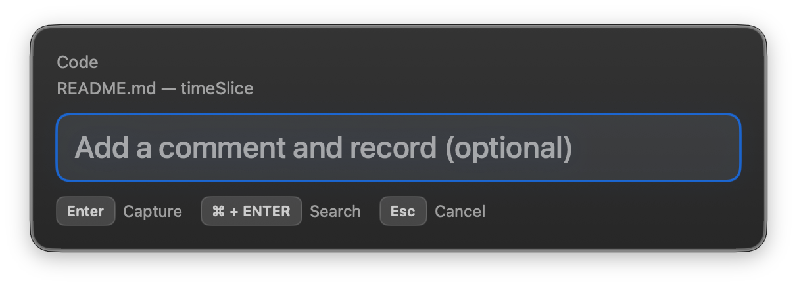
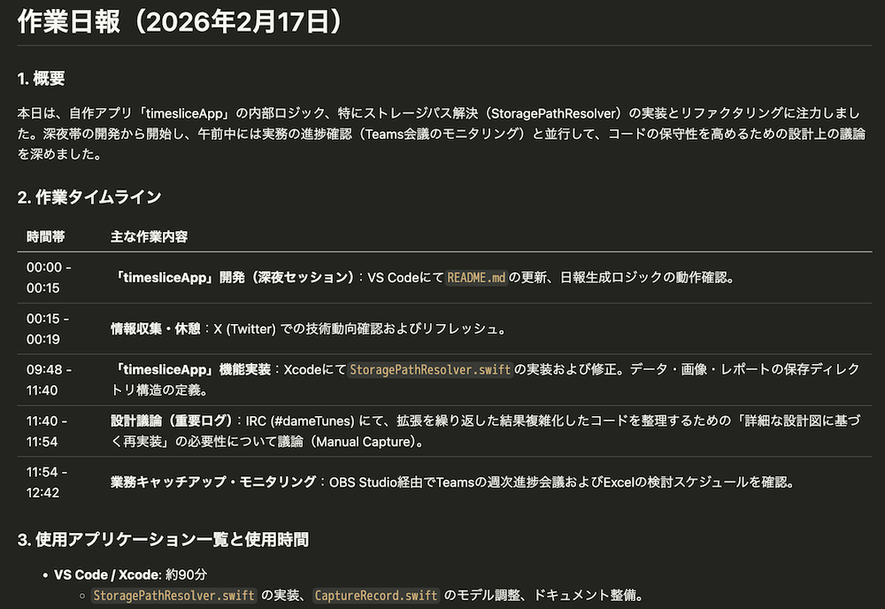
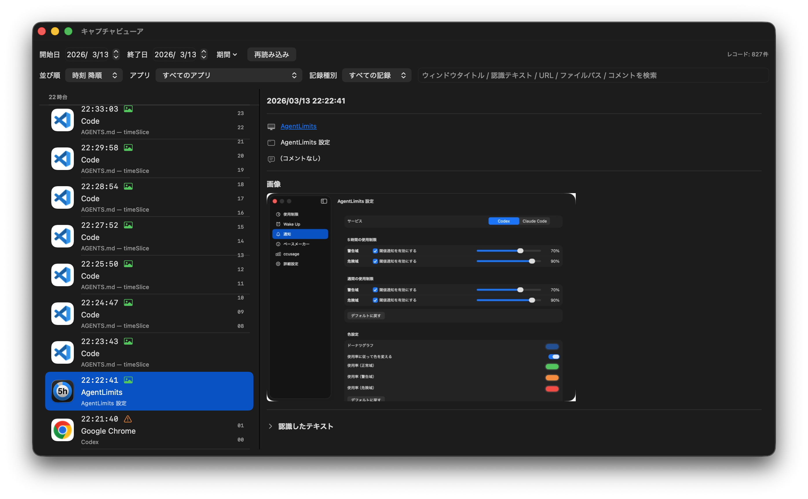

# timeSlice

**Under Development**

timeSlice is a macOS Sonoma+ menu bar app that periodically captures the frontmost window, performs text recognition using the Vision Framework, and stores the results locally. By feeding the accumulated data to an AI agent CLI, you can automatically generate a daily work report.

## Features
- Periodic capture of the frontmost window (default: every 60 seconds)
- Manual capture of the frontmost window (with a comment input popup)
- Region capture by selecting an area (with a comment input popup)
- Retrieval of window title, document path, and active browser tab URL
- Text recognition from captured images (Vision Framework)
- Daily report generation using an AI CLI (scheduled and manual)
- Viewer window for browsing saved data

All text recognition is performed on-device; no data is sent to external servers. Note that when using AI for report generation, your prompt and recognized text will be sent to an external AI service unless you use a local LLM.

---

## Table of Contents

1. [Download](#download)
2. [First Launch](#first-launch)
3. [Menu Bar Operations](#menu-bar-operations)
4. [How Capture Works](#how-capture-works)
5. [Report Generation](#report-generation)
6. [Settings Guide](#settings-guide)
   - [General Tab](#general-tab)
   - [Capture Tab](#capture-tab)
   - [CLI Tab](#cli-tab)
   - [Report Tab](#report-tab)
   - [Prompt Tab](#prompt-tab)
7. [Viewer Window](#viewer-window)
8. [Data Storage Location](#data-storage-location)
9. [Permissions](#permissions)
10. [Troubleshooting](#troubleshooting)
11. [Building from Source](#building-from-source)

---

## Download

Download the latest release here: [Download](https://github.com/Nihondo/timeSlice/releases/latest/download/timeSlice.zip)

---

## First Launch

1. Unzip the downloaded file and move `timeSlice.app` to your Applications folder.
2. On first launch, a **Screen Recording** permission dialog will appear. Click "OK" to allow it (capture will not work without this permission).
3. Once the icon appears in the menu bar, the app is running. Click the icon and select **"Start Recording"** to begin capturing your work.
4. To generate reports, configure your AI agent CLI in the CLI tab first, then click **"Generate Report"**.

---

## Menu Bar Operations

The menu bar icon changes appearance based on the recording state: a white circle when idle, a red circle when recording.

Clicking the icon shows the following menu:

| Menu Item | Description |
|---|---|
| **timeSlice Settings...** (⌘,) | Opens the settings window |
| **Start / Stop Recording** | Toggles capture on or off |
| **Capture Now** | Opens the comment input popup; press Enter to record, ⌘ + Enter to search in Viewer |
| **Capture Rectangle** | Select a rectangular region on screen to capture, then shows the comment input popup |
| **Generate Report** | Generates a report based on enabled time slots. If one slot is enabled, generates for that slot; if multiple, a submenu lets you choose |
| **Open Viewer** | Opens the Capture Viewer in a separate window (configurable global shortcut) |
| **About timeSlice...** | Shows app version information |
| **Quit** (⌘Q) | Quits the app |

### About "Capture Now"



Triggering "Capture Now" opens a Spotlight-like comment input popup. Enter a comment and press Enter to immediately capture, perform text recognition, and save. The comment is optional.

Press ⌘ + Enter to skip saving and instead open the Capture Viewer with your input as a search query. Press Esc to cancel without saving.

The top of the popup shows the target app name and window title on two lines without labels (displays "(No Title)" if unavailable).

When the popup opens, any text currently selected in the frontmost app is automatically filled into the comment field (requires Accessibility permission).

Setting a global shortcut key allows you to trigger "Capture Now" from any app. See [General Tab](#general-tab) for shortcut configuration.

### About "Capture Rectangle"

Triggering "Capture Rectangle" uses macOS's `screencapture` command to let you select any rectangular region on screen.

After selection, text recognition is performed on the captured image, and a comment input popup (same as "Capture Now") is displayed. Press Enter to save the record, or Esc to cancel — the capture itself is discarded and nothing is saved.

This feature works independently of periodic capture, so it can be used at any time regardless of whether recording is active. The `captureTrigger` in the saved data will be `rectangleCapture`.

Setting a global shortcut key allows you to trigger "Capture Rectangle" from any app. See [General Tab](#general-tab) for shortcut configuration.

---

## How Capture Works

While recording, timeSlice automatically captures the frontmost window at the configured interval (default: 60 seconds). Each capture goes through the following steps:

First, it checks whether the frontmost app name or window title partially matches any exclusion keyword. If matched, text recognition and image saving are skipped, and only metadata (app name, window title, etc.) is stored. Use this to exclude windows with private or sensitive information.

If not excluded, the Vision Framework extracts text from the window. If the content matches the previous record (same hash), it is skipped as a duplicate; a new record is only saved when the content changes.

Saved data includes a JSON record (always) and an image file (if enabled in settings). Image format can be set to `PNG` or `JPG`. The JSON contains: timestamp, app name, window title, recognized text, capture trigger (scheduled or manual), comment, browser URL, document file path (if available), and app bundle path (for icon resolution).

### Browser URL Capture

When the frontmost app is a supported browser, timeSlice automatically retrieves the active tab URL via AppleScript and includes it in the record. Supported browsers:

| Browser | Support |
|---|---|
| Safari (including Technology Preview) | ✅ |
| Google Chrome (including Beta / Dev / Canary) | ✅ |
| Microsoft Edge (including Beta / Dev / Canary) | ✅ |
| Brave Browser (including Beta / Nightly) | ✅ |
| Arc | ✅ |
| Vivaldi | ✅ |
| Firefox | ❌ (No AppleScript support) |

On the first URL retrieval for each browser, macOS will show an Automation permission dialog. Click "OK" to allow. Permission must be granted separately for each browser. If denied, the URL will simply be `null` and capture continues normally.

---

## Report Generation

timeSlice calls an external AI agent CLI (such as `opencode`, `codex`, `claude`, `gemini`, etc.) to generate daily reports. Consider using a CLI like `opencode` that supports local LLMs.

### Sample Output



The above is an example report generated with the following prompt. You can freely customize the prompt.

```
The following is work record data for {{DATE}} ({{TIME_RANGE}}).
The current working directory is `timeSlice/data`.
Please read the following files and create a daily report summarizing the content:
{{JSON_FILE_LIST}}

Approximate expected record count: {{RECORD_COUNT}}

JSON structure:
- `applicationName`: Frontmost app name
- `windowTitle`: Window title (may be null)
- `capturedAt`: ISO 8601 timestamp of the record
- `recognizedText`: Recognized text
- `hasImage`: Image save flag
- `captureTrigger`: Record trigger (`manual` = Capture Now, `scheduled` = periodic capture, `rectangleCapture` = region capture)
- `comments`: Manual record comment (may be empty string)
- `browserURL`: Active browser tab URL (may be null, browser apps only)
- `documentPath`: Document file path (may be null, supported apps only)
- `applicationBundlePath`: App bundle path (may be null, for icon resolution)

Important:
- The target time range is {{TIME_RANGE}}. Only include records where `capturedAt` falls within this range.
- Records with `captureTrigger` of `manual` or `rectangleCapture` are intentional logs by the user — treat them as high priority.
- Records with non-empty `comments` are intentional memos — give them the highest priority in the summary.
- The overview, work timeline, and deliverables/progress must include content based on `manual` / `rectangleCapture` records.

Write the report in Markdown with the following structure:
1. Overview (2–3 sentences)
2. Work Timeline (by time period)
3. Applications Used and Time Spent
4. Deliverables / Progress
5. Impressions (optional)
```

### Generation Flow

When you trigger report generation, timeSlice expands the prompt template and launches the AI CLI with the `data/` directory as the working directory. The AI CLI reads the JSON files directly from the paths in the prompt and outputs the report to stdout. timeSlice captures the output and saves it as a Markdown file.

### Time Slots and Output File Names

If only one time slot is enabled, the report is saved as `report.md`. If multiple slots are enabled, each report includes the time in its filename (e.g., `report-0800-1200.md`).

If a report is regenerated on the same day, the existing file is backed up as `report-YYYY-MM-DD-HHmmss.md` before being overwritten.

Scheduled auto-generation runs once per time slot at the slot's end time.
If multiple backup files like `report-1800-2410-YYYY-MM-DD-HHmmss.md` exist for the same slot, it means the output file was overwritten multiple times during that time period.

### Cross-Midnight Slots

Slots with an end time past 24:00 (e.g., `18:00–25:00`) execute in the early hours of the next day and generate a report for the previous day's records. For example, a slot ending at `25:00` (1:00 AM the next day) creates a report covering records from 18:00 onward of the previous day.

### Notifications

A notification is sent to Notification Center when report generation succeeds. Clicking the notification opens the saved report file. If generation fails, a notification showing the error is also sent.

Clicking the completion notification for "Capture Now" or "Capture Rectangle" opens the Capture Viewer with the corresponding record selected.

The most recent execution details (command, prompt, output, success/failure, error message) are saved to `logs/report-last-run.json` for debugging.

---

## Settings Guide

Open the settings window by selecting **"timeSlice Settings..."** (⌘,) from the menu bar.

### General Tab

**Permissions (Screen Recording / Accessibility / Automation)**

The General tab shows the status of three permission types:

- Screen Recording (required for capture)
- Accessibility (required for auto-filling selected text into the "Capture Now" popup and for retrieving document paths)
- Automation (required for browser URL retrieval)

You can try requesting Screen Recording and Accessibility permissions using the "Request" button in each row. Click "Refresh Permission Status" to re-check the current state.

Automation permissions are managed per browser and cannot be checked in bulk. Use the "Open System Settings" button to go directly to the Automation screen in Privacy settings. macOS will automatically show a permission dialog on the first browser URL retrieval, so no pre-configuration is needed.

**Keyboard Shortcuts**

You can configure three global shortcuts: "Capture Now", "Capture Rectangle", and "Open Viewer". Click a shortcut field to enter input mode, then press a key combined with one of ⌘ / ⌥ / ⇧ / ⌃ to register it. Press Esc to cancel, or Delete to clear the shortcut.

Configured shortcuts are system-wide and work even when other apps are in focus. Pressing the "Capture Now" shortcut shows the comment input popup and auto-fills any text selected in the frontmost app (Accessibility permission required; a permission dialog will appear on first use if not yet granted).

Pressing the "Capture Rectangle" shortcut enters screen selection mode, and the comment popup appears after you make a selection. Pressing the same shortcut again while the popup is visible dismisses the popup and cancels the action.

Pressing the "Open Viewer" shortcut opens the Capture Viewer window.

**Startup Settings**

Enable "Start recording on app launch" to automatically begin recording when timeSlice starts. Enable "Launch at login" to have timeSlice start automatically when you log into macOS.

---

### Capture Tab

**Capture Interval**

Use the slider to set the periodic capture interval (10–600 seconds, default: 60 seconds). Shorter intervals produce more detailed records but increase storage usage.

**Minimum Text Length**

For periodic captures, lines in the OCR result shorter than this character count are excluded (default: 10 characters). If no valid lines remain after filtering, the capture is skipped. This avoids recording blank screens or windows with very little content.

**Excluded Apps / Excluded Keywords**

Adding a keyword will skip text recognition when the frontmost app name or window title partially matches it. For periodic captures, text recognition results are also checked — if the recognized text partially matches a keyword, the capture is similarly skipped.

In either case, no text or image is saved — only metadata (app name, window title, etc.) is stored. Useful for password managers, personal messaging apps, or any app you don't want captured.

You can also use specific strings like `apikey` as keywords to exclude captures that may contain sensitive information such as API keys.

**Save Images**

When this toggle is enabled, captured images are saved in addition to recognized text. Image format can be set to `PNG` or `JPG` (default: `PNG`). Images are retained for 3 days.

---

### CLI Tab

Configure the AI agent CLI used for report generation.

**Saved Sets (Command + Arguments)**

CLI configurations are saved as "sets". Select a set from the top dropdown, use `+` to add a new one, or `-` to delete the current one.

Each set includes:
- Set name
- CLI command name (e.g., `codex`, `claude`, `gemini`, `opencode`)
- Additional arguments

Specify `-p` or `--prompt` in the additional arguments. The prompt string is appended after the specified argument flag.
- Example 1: codex `exec --skip-git-repo-check` {{PROMPT}}
- Example 2: claude `-p` {{PROMPT}}
- Example 3: gemini `-p` {{PROMPT}}
- Example 4: opencode `--prompt` {{PROMPT}}

The currently selected set is used for both manual and scheduled generation.

**Timeout**

Set the CLI execution timeout (30–3600 seconds, default: 300 seconds). Increase this if AI processing takes a long time.

---

### Report Tab

**Scheduled Auto-Generation and Time Slots**

Enabling "Scheduled Auto-Generation" causes reports to be automatically generated at the end time of each configured time slot.

Each time slot row lets you configure: start time, end time, enabled/disabled status, and the prompt template to use. Times increment/decrement in 10-minute steps; rolling past 50 minutes increments the hour, and rolling before 0 minutes decrements it.

The prompt dropdown in each row lets you assign a specific template to that slot's report generation (select "Default" to use the default template).

The following four slots are registered by default:

| Slot | Status |
|---|---|
| 08:00 – 25:00 (Full Day) | Enabled |
| 08:00 – 12:00 (Morning) | Disabled |
| 12:00 – 18:00 (Afternoon) | Disabled |
| 18:00 – 25:00 (Evening) | Disabled |

Enabling multiple slots generates separate reports per time period. If only one slot is enabled, the file is saved as `report.md`; if multiple are enabled, files are named with times (e.g., `report-0800-1200.md`).

The "Next" time shown is automatically calculated from enabled slots. If no slots are enabled, "No enabled slots" is displayed.

**Report Output Directory**

If you want to change the save location, specify a directory here. If not set, reports are saved to `~/Library/Application Support/timeSlice/reports/`.

**Manual Generation**

Select a target date and click "Generate Report Now" to immediately generate a report for that date. You can also click the ▶ button on an individual time slot row to manually generate for that slot only.

The **"Generate Report"** menu item in the menu bar also reflects time slot settings. If one slot is enabled, it generates for that slot; if multiple, a submenu lets you choose. If no slots are enabled, it generates a full-day report.

---

### Prompt Tab

Manage and edit the prompt templates passed to the AI CLI.

**Managing Multiple Templates**

Switch between templates using the dropdown menu. The "Default" template cannot be modified. Click "+" to add a new template, or "−" to delete the selected one. Template names can be edited directly in the name field.

Click "Reset to Default Content" to reset the currently selected template's content to the initial default.

Changes are auto-saved.

**Placeholders**

The following placeholders can be used in templates and are replaced with actual values at report generation time:

| Placeholder | Content |
|---|---|
| `{{DATE}}` | Target date (e.g., 2026-02-16) |
| `{{TIME_RANGE}}` | Target time range (e.g., "08:00-12:00"; full day shows "Full Day") |
| `{{JSON_GLOB_PATH}}` | Glob paths for JSON files (space-separated) |
| `{{JSON_FILE_LIST}}` | Glob paths for JSON files (newline-separated) |
| `{{RECORD_COUNT}}` | Approximate number of target records |

---

## Viewer Window



Select **"Open Viewer"** from the menu bar to browse saved captures in a dedicated window.

Choose a start and end date to display records for that period, with JSON and image associations shown together. Presets are available: `Today`, `Yesterday`, `Last 3 Days`, `Last 7 Days`, `Last 30 Days`, `All Time`.

- Left pane: Record list (app icon, timestamp, app name, window title, image status). For single-day views, records are grouped into hourly sections (e.g., "9:xx", "10:xx") with a time-based side index for quick navigation. For multi-day views, records are grouped by date with a date-based side index.
- Right pane: Details (image preview, comment, recognized text, URL/file path). Click the app name to launch the app; right-click for "Launch App" or "Reveal in Finder".
- Manually triggered records (`manual` / `rectangleCapture`) show an indicator next to the timestamp in both panes.
- Top controls:
  - Date range (start date / end date)
  - Period presets (Today / Yesterday / Last 3 Days / Last 7 Days / Last 30 Days / All Time)
  - Time sort (ascending / descending)
  - App name filter (popup menu with app icons)
  - Record type filter (All records / Manual only) — "Manual only" includes both `manual` and `rectangleCapture`
  - Text search (searches window title / recognized text / URL / file path / comments; press Enter to apply)
  - Reload
- The time sort selection is persisted in app settings and restored on next launch.
- Text search matches are highlighted in both the list and detail views.

Image status has three states:

- **Present**: Image file exists
- **Not Saved**: Record was captured when image saving was disabled
- **Missing / Expired**: JSON has `hasImage=true` but the image file does not exist (e.g., expired after the 3-day retention period)

URLs in the detail pane are clickable. File paths are also clickable and support right-click actions: "Open", "Reveal in Finder", and "Copy File Path". URLs also support right-click: "Open" and "Copy URL".

Image previews support right-click: "Open", "Reveal in Finder", and "Delete" (moves to Finder Trash).

Right-clicking a record in the left pane lets you reveal the associated JSON in Finder or delete the entire record (moves both JSON and linked image to Finder Trash).

## Data Storage Location

All data is stored locally. No data is sent to external servers. Note that when using AI for report generation, your prompt and recognized text will be sent to an external AI service unless you use a local LLM.

Data is stored in the following directory structure:

```
~/Library/Application Support/timeSlice/
├── data/YYYY/MM/DD/HHMMSS_xxxx.json         # Capture records (retained for 30 days)
├── images/YYYY/MM/DD/HHMMSS_xxxx.(png|jpg)  # Screenshots (retained for 3 days)
├── logs/report-last-run.json                 # Most recent report generation log
└── reports/YYYY/MM/DD/
    ├── report.md                             # Full-day report (when one slot is enabled)
    ├── report-0800-1200.md                   # Time-slot report (morning example)
    ├── report-1200-1800.md                   # Time-slot report (afternoon example)
    ├── report-1800-2500.md                   # Time-slot report (evening example)
    └── report-YYYY-MM-DD-HHmmss.md           # Backup created on re-generation
```

---

## Permissions

timeSlice uses the following permissions:

### Screen Recording

Required for capture. A permission dialog is shown on first launch. If it was not shown or was accidentally denied, follow these steps to grant it manually:

1. Open "System Settings".
2. Go to "Privacy & Security" → "Screen Recording".
3. Find timeSlice in the list and enable it.

### Accessibility (Selected Text / Document Path)

Used for auto-filling selected text into the "Capture Now" popup and for retrieving document paths from supported apps. Capture and saving continue to work without this permission, but selected text auto-fill and document path retrieval will be disabled.

If the permission dialog is not shown on first use or was accidentally denied, follow these steps:

1. Open "System Settings".
2. Go to "Privacy & Security" → "Accessibility".
3. Find timeSlice in the list and enable it.

### Automation (Browser URL)

Required to retrieve the active browser tab URL via AppleScript. macOS automatically shows a permission dialog the first time a URL is retrieved from each browser.

If accidentally denied, follow these steps:

1. Open "System Settings".
2. Go to "Privacy & Security" → "Automation".
3. Under the timeSlice entry, enable the target browser.

You can also access the Automation settings directly via the "Open System Settings" button in the General tab of the settings window.

---

## Troubleshooting

**"Command not found" error during report generation**

macOS GUI apps have a restricted PATH at launch, so CLI commands available in Terminal may not be found. timeSlice automatically adds `/opt/homebrew/bin`, `/usr/local/bin`, `~/.local/bin`, and similar paths to PATH, but if the command is still not found, try specifying its full path in the CLI command field (e.g., `/opt/homebrew/bin/gemini`).

**Screen Recording permission dialog did not appear**

See [Screen Recording](#screen-recording) and grant the permission manually.

**Report content is incorrect / generation fails**

The most recent execution log is saved in `logs/report-last-run.json`. Check the command, prompt, CLI output, and error message to identify the cause.
You may also need to navigate to `~/Library/Application Support/timeSlice/` and launch the CLI manually first to grant it the necessary access permissions.

**Scheduled auto-generation runs multiple times at the same time**

First check the `runAt` field in `logs/report-last-run.json` and the output file names to confirm whether multiple executions occurred for the same slot.
If multiple `report-<slot>-YYYY-MM-DD-HHmmss.md` backup files exist for the same slot, it means the output file was overwritten multiple times.
The current version uses internal generation counter management to prevent duplicate executions caused by restart races during settings updates. If the issue recurs, please file an issue with the relevant `report-last-run.json` and the list of generated files.

---

## Building from Source

Only Xcode project format is supported. `swift build` / `swift run` do not work.

```bash
# Build
xcodebuild -project timeSlice.xcodeproj -scheme timeSlice -configuration Debug -derivedDataPath ./.xcode-derived build

# Launch
open ./.xcode-derived/Build/Products/Debug/timeSlice.app
```

Screen Recording permission is bound to the app bundle (`.app`), so always launch via `.app` rather than running the binary directly from Terminal.

To create a Release archive, ensure the Team and certificate are correctly configured in Signing & Capabilities, enable Hardened Runtime, and build.
